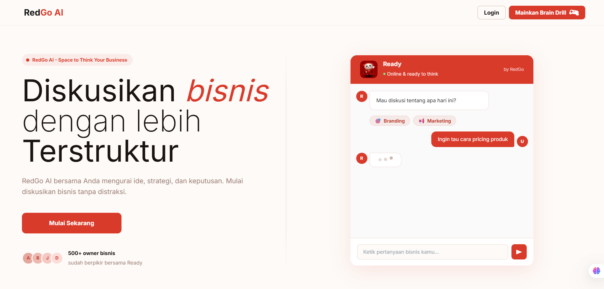
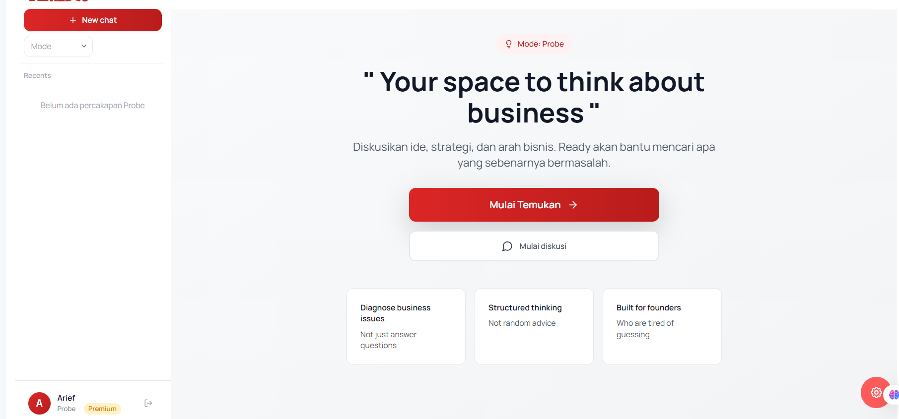
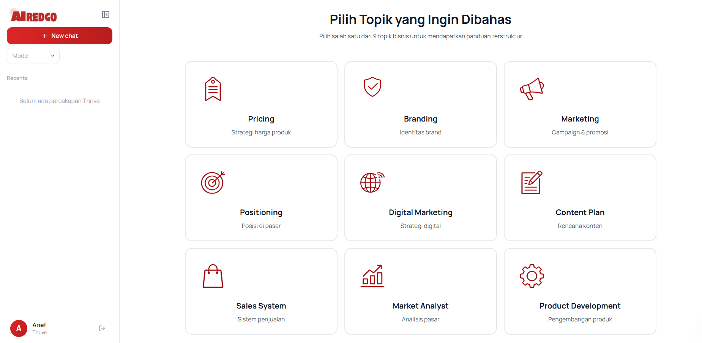
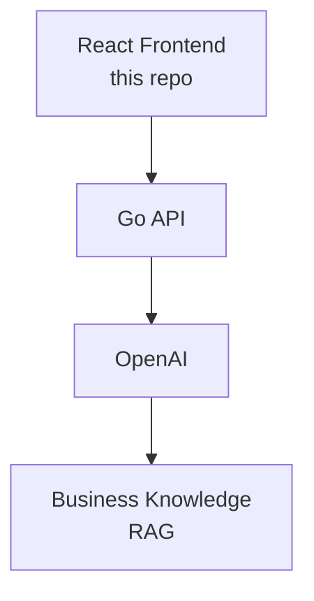

<div align="center">

# RedGo AI — Frontend

**AI-powered Business Consultation Platform**
Turning expert business reasoning into structured, AI-driven decision support.


</div>

---

## Overview

RedGo AI enables founders and SMEs to receive structured business guidance through an AI-powered consultation experience inspired by real-world business consulting practices.

Instead of answering questions directly like a generic chatbot, RedGo first guides users through a structured business diagnosis to uncover the real constraints behind their problem — then generates recommendations grounded in an expert-designed decision framework using Retrieval-Augmented Generation (RAG).

This repository contains the **React frontend** — the client interface for the diagnosis flow, AI chat, and the admin tools (prompt, knowledge base, role, and user management) that power the platform.

> The backend (Go API, AI workflow, RAG pipeline) lives in a separate repository — see [Backend Repository](#REDGO-BACKEND).

---

## Features

- **Structured Business Diagnosis** — guided questionnaire before any AI response, so users uncover the real problem first
- **AI Consultation Chat** — attachments, voice input, conversation export
- **Knowledge Base (RAG) Management** — manage the business knowledge the AI retrieves from
- **Prompt Management** — edit and version the reasoning prompts behind the AI
- **Role & User Management** — permission-based access control for the platform
- **Full Auth Flow** — login, register, forgot/reset password, 2FA, OAuth callback

---
## Screenshots
 
| Landing | Probe Mode | Thrive Mode |
|---|---|---|
|  |  |  |
 
---

## Architecture Preview



Full system design, prompt architecture, and RAG pipeline details live in the [backend repository](#backend-repository).

---

## UI Flow

```
Landing → Diagnosis → Chat → Recommendation
```

The product deliberately front-loads **Diagnosis** before **Chat** — the AI doesn't answer until it understands the business context first.

---

## Tech Stack

Versions reflect `package.json` exactly.

| Category | Stack |
|---|---|
| Framework | React 19, TypeScript 5.5 |
| Build Tool | Vite 5 |
| UI | Material UI (MUI) v7, Emotion |
| Styling | Tailwind CSS 3, tailwind-merge, class-variance-authority |
| Routing | React Router v7 (data mode) |
| Data/State | TanStack Query v5 |
| Forms | React Hook Form |
| i18n | i18next, react-i18next |
| Animation | Framer Motion, React Spring |
| HTTP | Axios |
| Markdown | react-markdown, remark |
| Audio | react-media-recorder |
| Testing | Playwright (E2E) |
| Linting | ESLint 9, typescript-eslint |

---

## Project Structure

```
frontend/
├── src/
│   ├── app/                     # Core: api clients, auth, guards, providers, router, services
│   │   ├── api/                  # auth, chat, payment, permission, prompt, rag, role, user
│   │   ├── guards/                # Route guards (Auth, Admin, Guest, Permission)
│   │   └── router/                # Route definitions & navigation config
│   │
│   ├── features/                 # Feature-based modules
│   │   ├── auth/                  # Login, register, 2FA, landing page
│   │   ├── chat/                  # AI chat: diagnosis flow, engine questionnaire
│   │   ├── prompts/                # Prompt management (CRUD)
│   │   ├── rag/                    # Knowledge base management
│   │   ├── role/                   # Role & permission management
│   │   └── user/                   # User management
│   │
│   ├── shared/                    # Layouts, design system (venturo-ui), hooks, i18n, theme
│   │
│   ├── App.tsx
│   └── main.tsx
│
├── tests/                        # Playwright E2E tests
├── vite.config.ts
├── tailwind.config.ts
└── package.json
```

<details>
<summary>Full folder tree</summary>

```
frontend/
├── src/
│   ├── app/
│   │   ├── api/
│   │   │   ├── auth/
│   │   │   ├── chat/
│   │   │   ├── payment/
│   │   │   ├── permission/
│   │   │   ├── prompt/
│   │   │   ├── rag/
│   │   │   ├── role/
│   │   │   └── user/
│   │   ├── auth/
│   │   ├── constants/
│   │   ├── guards/
│   │   ├── lib/
│   │   ├── providers/
│   │   ├── router/
│   │   └── services/
│   │
│   ├── assets/
│   │
│   ├── features/
│   │   ├── auth/
│   │   ├── chat/
│   │   ├── errors/
│   │   ├── prompts/
│   │   ├── rag/
│   │   ├── role/
│   │   ├── sample-page/
│   │   └── user/
│   │
│   ├── shared/
│   │   ├── components/
│   │   │   ├── layouts/
│   │   │   ├── theme-ui/
│   │   │   └── venturo-ui/
│   │   ├── contexts/
│   │   ├── hooks/
│   │   ├── styles/
│   │   ├── theme/
│   │   ├── types/
│   │   └── utils/
│   │
│   ├── App.tsx
│   └── main.tsx
│
├── tests/
│   ├── e2e/
│   └── features/auth/
│
├── index.html
├── vite.config.ts
├── tailwind.config.ts
├── tsconfig.json
└── package.json
```

</details>

---

## Getting Started

### Prerequisites
- Node.js ≥ 18
- npm

### Installation

```bash
git clone https://github.com/<your-org>/redgo-ai-frontend.git
cd redgo-ai-frontend
npm install
```

### Run

```bash
npm run dev        # http://localhost:5173
npm run build       # tsc && vite build
npm run preview
npm run lint
```

### Testing

```bash
npm run test:e2e         # headless
npm run test:e2e:ui      # interactive UI
npm run test:e2e:headed  # watch the browser
npm run test:e2e:report  # last HTML report
```

---

## Environment Variables

Create a `.env` file in the project root:

```env
VITE_API_BASE_URL=http://localhost:8080
VITE_APP_NAME=RedGo AI
```

> Adjust to match your backend configuration.

---

## Backend Repository

| Repository | Description |
|---|---|
| [`redgo-ai-backend`](#) | Go REST API, AI workflow orchestration, RAG pipeline |
| [`redgo-ai-docs`](#) | System design, prompt architecture, AI evaluation notes |

---

## Project Status

Prototype completed. Development is currently paused while the business strategy and product direction are being refined prior to the next iteration.

---

## Design Philosophy

RedGo AI was designed around a simple principle:

Business decisions should not be generated from the language model alone.

Instead, recommendations should be grounded in structured business knowledge and expert-designed decision frameworks, enabling AI to assist users with more consistent and context-aware guidance.


## License

Private Project.
